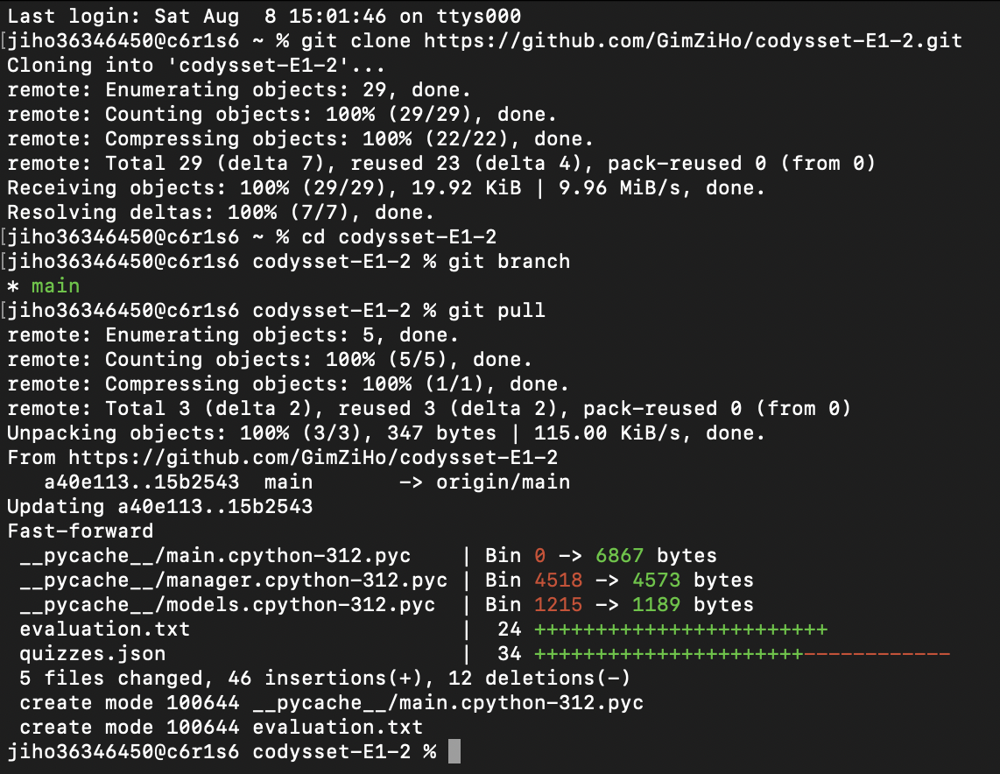
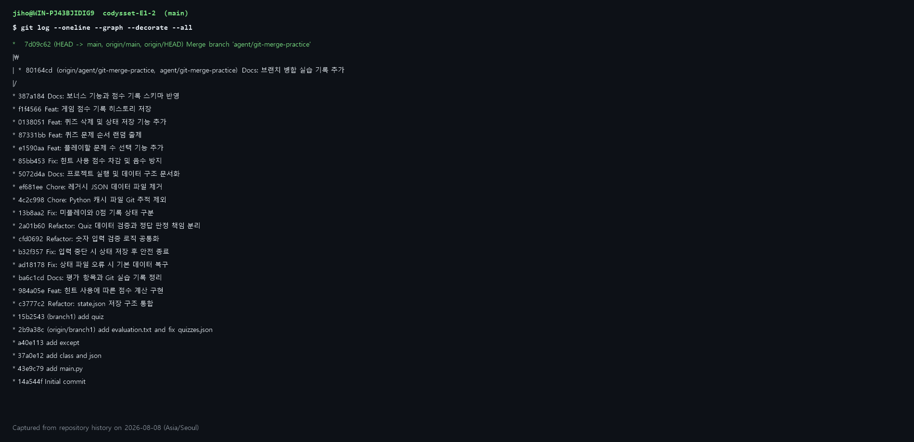

# Python 콘솔 퀴즈 게임

## 프로젝트 개요

Python 기본 문법과 객체 지향 구조를 활용해 만든 터미널 퀴즈 게임입니다. 퀴즈 플레이, 문제 추가·삭제, 목록 조회, 최고 점수와 플레이 기록 확인을 지원하며 데이터는 `state.json`에 저장됩니다.

## 퀴즈 주제와 선정 이유

퀴즈 주제는 동물 상식입니다. 평가할 때, 생각해야하는 문제를 만나면 당황스러워 동물문제를 선택했습니다.

## 실행 환경

- Python 3.10 이상
- 외부 라이브러리 없음

## 실행 방법

```bash
git clone git@github.com:GimZiHo/codyssey-E1-2.git
cd codyssey-E1-2
python3 main.py
```

Windows에서 `python3` 명령을 사용할 수 없다면 `python main.py`로 실행합니다.

## 기능 목록

- 퀴즈 풀기, 문제 수 선택 및 무작위 출제
- 힌트 사용 시 10점 감점(최종 점수는 0점 이상)
- 문제와 선택지 4개, 정답, 힌트 추가
- 퀴즈 목록 조회 및 선택한 퀴즈 삭제
- 최고 점수와 전체 플레이 기록 저장·조회
- 빈 입력, 잘못된 숫자, 범위 밖 입력 재처리
- `Ctrl+C` 또는 EOF 발생 시 상태 저장 후 안전 종료
- `state.json`이 없거나 손상된 경우 기본 퀴즈로 복구

### 메뉴 동작 흐름

프로그램을 실행하면 메인 메뉴가 반복해서 표시됩니다. `1`은 문제 수를 선택한 뒤 무작위 퀴즈를 풀고 점수를 저장하며, `2`는 문제·선택지·정답·힌트를 입력해 새 퀴즈를 추가합니다. `3`은 등록된 퀴즈 목록, `4`는 최고 점수와 플레이 기록을 보여주고, `5`는 목록에서 선택한 퀴즈를 삭제해 즉시 저장합니다. `6`은 메뉴 반복을 끝내고 프로그램을 종료합니다. 메뉴에서 빈 값, 문자, 또는 1~6 범위 밖 숫자를 입력하면 원인을 안내하고 유효한 번호를 다시 입력받습니다.

## 파일 구조

```text
codysset-E1-2/
├── main.py                     # 프로그램 실행 진입점
├── quiz/
│   ├── __init__.py             # quiz 패키지
│   ├── quiz.py                 # Quiz 클래스와 데이터 검증
│   ├── quiz_manager.py         # 퀴즈 목록과 JSON 입출력
│   └── quiz_game.py            # 메뉴, 입력 검증, 게임 진행
├── state.json                  # 퀴즈, 점수, 플레이 기록
├── evaluation.txt              # 동료평가 질문과 설명 답변
├── screenshot/                 # Git 실습 증빙 이미지
├── .gitignore
└── README.md
```

## 클래스 설계와 채택 이유

- `Quiz`는 문제, 선택지, 정답, 힌트와 정답 확인·JSON 변환 동작을 하나의 객체로 묶습니다.
- `QuizManager`는 퀴즈 목록, 최고 점수, 플레이 기록을 관리하고 `state.json`을 읽고 쓰는 책임을 담당합니다.
- `QuizGame`은 메뉴와 사용자 입력, 퀴즈 진행처럼 화면 흐름을 담당합니다.

클래스를 사용하면 서로 관련된 데이터와 동작을 함께 관리할 수 있고, 게임 진행·데이터 저장·개별 퀴즈의 책임이 분리됩니다. 따라서 전역 변수 의존을 줄이고, 기능을 수정하거나 객체별로 테스트하기 쉬우며, 퀴즈가 늘어나도 같은 구조를 재사용할 수 있습니다.

함수만 사용하는 방식은 작은 프로그램에서 구조가 단순하고 작성할 코드가 적다는 장점이 있습니다. 하지만 여러 함수에 퀴즈 목록과 점수 같은 상태를 계속 전달하거나 전역 변수로 관리해야 하므로 프로그램이 커질수록 데이터와 동작의 관계를 파악하기 어렵습니다. 반대로 클래스는 초기 설계와 코드량이 더 필요하므로, 상태가 거의 없는 짧은 작업에는 일반 함수가 더 적합할 수 있습니다. 이 프로젝트는 여러 퀴즈의 상태를 저장하고 메뉴 동작을 확장해야 하므로 클래스를 채택했습니다.

## 요구 변경 가이드

요구사항이 바뀌면 변경 책임에 따라 다음 모듈을 수정합니다.

| 변경 대상 | 담당 모듈 | 확인할 내용 |
| --- | --- | --- |
| 퀴즈 데이터 구조와 검증 | `models.py` | `Quiz` 속성, 입력값 검증, `to_dict()`와 `from_dict()` |
| 기본 데이터와 저장 형식 | `manager.py` | `DEFAULT_QUIZ_DATA`, 불러오기 검증, 저장 스키마, 점수 기록 |
| 메뉴, 입력, 게임 규칙 | `main.py` | `QuizGame`의 화면 흐름, 입력 범위, 출제 및 점수 계산 |
| 사용법과 데이터 예시 | `README.md`, `state.json` | 문서·예시 갱신 및 기존 데이터 호환성 |

예를 들어 정답 점수를 20점에서 30점으로, 힌트 감점을 10점에서 5점으로 바꾸려면 다음 순서로 작업합니다.

1. `main.py`의 `QuizGame.play_quiz()`에서 정답 가산점, 힌트 감점, `total_possible` 계산을 같은 기준으로 수정합니다.
2. 기록 필드 자체가 바뀌는 경우에만 `manager.py`의 `record_game()`과 저장 검증도 함께 수정합니다. 기존 `score_history`는 당시 규칙의 결과이므로 재계산하지 않고 유지하거나, 규칙 버전 필드를 추가합니다.
3. README의 기능 및 JSON 예시를 새 규칙에 맞게 고치고, 정답·오답·힌트 사용·0점 하한·최고 점수 갱신을 실행해 확인합니다.

선택지를 4개에서 가변 개수로 바꾸는 경우에는 다음 결합 지점을 모두 수정해야 합니다.

1. `models.py`에서 선택지 개수와 정답 범위를 고정값 `4`가 아니라 `len(choices)` 기준으로 검증합니다.
2. `main.py`의 `add_quiz_ui()`에서 선택지 입력 반복 횟수와 안내 문구·정답 입력 범위를 바꾸고, 플레이 입력 범위가 실제 선택지 개수를 사용하는지 확인합니다.
3. `manager.py`의 기본 퀴즈와 `state.json` 기존 데이터가 새 검증을 통과하는지 확인합니다. 저장 구조를 변경했다면 `from_dict()`에 이전 형식을 읽는 변환 절차도 추가합니다.
4. 최소·최대 선택지, 잘못된 정답 번호, 기존 JSON 불러오기, 추가 후 재시작 시 데이터 유지 과정을 확인합니다.

## 데이터 파일

프로젝트 루트의 `state.json`을 UTF-8 JSON 형식으로 읽고 씁니다. JSON은 사람이 직접 읽고 수정하기 쉽고, 별도 라이브러리 없이 Python 표준 라이브러리로 처리할 수 있어 가볍습니다. 또한 다양한 언어와 환경에서 지원하므로 데이터를 다른 프로그램과 공유하기 쉽다는 장점이 있어 선택했습니다. 퀴즈 추가·삭제, 게임 완료, 안전 종료 시 변경 사항을 저장합니다.

```json
{
  "quizzes": [
    {
      "question": "파이썬에서 화면에 문자를 출력하는 함수는?",
      "choices": ["input", "print", "len", "type"],
      "answer": 2,
      "hint": "출력을 뜻하는 영어 단어입니다."
    }
  ],
  "best_score": 80,
  "has_played": true,
  "score_history": [
    {
      "played_at": "2026-08-08T18:47:37+09:00",
      "quiz_count": 5,
      "score": 80,
      "max_score": 100
    }
  ]
}
```

### 필드와 구조 설계 이유

- `quizzes`는 문제 개수가 바뀔 수 있고 순서대로 출제해야 하므로 배열로 저장합니다. 각 퀴즈는 서로 관련된 `question`, `choices`, `answer`, `hint`를 하나의 객체로 묶어 문제 단위로 추가·삭제하거나 `Quiz` 객체로 변환하기 쉽게 설계했습니다.
- `question`과 `hint`는 문장을 그대로 보존하기 위해 문자열로 저장합니다. `choices`는 네 선택지의 순서가 중요하므로 문자열 배열을 사용하고, `answer`는 해당 배열의 선택 번호와 바로 비교할 수 있도록 정수로 저장합니다.
- `best_score`는 매 게임 기록을 모두 탐색하지 않고도 최고 점수를 즉시 보여주기 위한 정수 필드입니다.
- `has_played`는 아직 게임을 하지 않은 상태와 게임을 완료했지만 0점을 받은 상태를 구분하기 위한 불리언 필드입니다. `best_score`만으로는 두 상태가 모두 0이어서 구분할 수 없습니다.
- `score_history`는 게임을 여러 번 진행할 때마다 기록을 누적하고 시간순으로 조회할 수 있도록 배열로 저장합니다. 각 원소는 한 번의 게임에서 함께 발생한 `played_at`, `quiz_count`, `score`, `max_score`를 하나의 객체로 묶은 중첩 구조입니다. 이렇게 묶으면 한 게임의 기록을 통째로 추가·삭제하거나 이후 통계 기능으로 확장하기 쉽습니다.
- 기록 안의 `played_at`은 날짜·시간과 시간대를 함께 보존하는 ISO 8601 문자열이고, `quiz_count`, `score`, `max_score`는 계산과 비교에 사용하는 정수입니다. 문제 수를 선택할 수 있으므로 `score`뿐 아니라 `max_score`도 함께 저장해 서로 다른 문제 수로 진행한 결과를 해석할 수 있게 했습니다.

### 대용량 확장 시 고려사항

현재 구조는 프로그램을 시작할 때 JSON 전체를 메모리에 올리고, 변경할 때마다 파일 전체를 다시 저장합니다. 퀴즈와 점수 기록이 1,000개 이상으로 증가하면 메모리 사용량과 시작·저장 시간이 데이터 크기에 비례해 늘어납니다. 또한 현재 목록 탐색은 배열을 처음부터 확인하는 선형 검색이고 전체 목록을 한 번에 출력하므로, 검색과 화면 확인이 느려질 수 있습니다. 여러 프로그램이 동시에 저장하면 마지막 쓰기가 앞선 변경을 덮어쓸 수 있고, 저장 도중 종료되면 파일 전체가 손상될 위험도 있습니다.

규모가 커질 때는 다음 순서로 개선할 수 있습니다.

1. 각 퀴즈에 고유한 `id`를 부여하고 메모리에서 `{id: quiz}` 형태의 딕셔너리 인덱스를 만들어 조회·삭제 속도를 개선합니다.
2. 목록은 페이지 단위로 출력하고, 주제나 키워드 필드를 추가해 필요한 문제만 검색합니다. 오래된 `score_history`는 별도 파일로 보관하거나 기간별로 나눕니다.
3. 임시 파일에 먼저 저장한 뒤 교체하는 원자적 저장과 파일 잠금을 적용해 JSON 손상 및 동시 쓰기 충돌을 줄입니다.
4. 데이터가 계속 증가하거나 조건 검색·동시 접근이 필요하면 SQLite로 전환합니다. `quizzes`와 `score_history`를 별도 테이블로 분리하고 기본 키, 외래 키, 검색 대상 열의 인덱스를 사용하면 전체 데이터를 메모리에 적재하지 않고도 필요한 행만 빠르게 조회·수정할 수 있습니다.

1,000개 정도의 단일 사용자 데이터는 JSON으로도 관리할 수 있지만, 검색 지연이나 파일 저장 시간이 체감되기 시작하면 페이지 처리와 인덱싱을 적용하고, 다중 사용자 또는 지속적인 데이터 증가가 예상되면 데이터베이스 전환을 우선합니다.

### 백업 및 복구 정책

현재 프로그램은 `state.json`이 없거나 손상되면 기본 퀴즈로 복구하지만 자동 백업은 아직 구현하지 않았습니다. 데이터 손실을 줄이기 위해 확장 시 다음 정책을 적용합니다.

- 정상 파일을 저장하기 전에 기존 `state.json`을 `backup/state-YYYYMMDD-HHMMSS.json`으로 복사하여 버전별 백업을 만듭니다.
- 최근 저장 시점 백업 5개를 순환 보관하고, 장기 복구용으로 최근 7일 동안 날짜별 마지막 백업 하나도 보관합니다. 이 기준보다 오래된 파일은 정리합니다.
- 파일이 손상되면 원본을 즉시 덮어쓰지 않고 `state.broken-YYYYMMDD-HHMMSS.json`으로 이동해 원인 확인과 수동 복구가 가능하게 합니다.
- 복구할 때는 가장 최근 백업부터 JSON 형식과 필수 필드를 검증합니다. 유효한 백업이 있으면 이를 `state.json`으로 복원하고, 유효한 백업이 없을 때만 기본 퀴즈로 초기화합니다.
- 저장 중 손상을 막기 위해 새 내용을 임시 파일에 기록하고 검증한 뒤 `state.json`과 교체하는 원자적 저장 방식을 함께 사용합니다.

저장소에 개인 플레이 기록이 불필요하게 쌓이지 않도록 `backup/`은 `.gitignore`에 등록하고, 필요한 백업은 별도 저장 장치나 클라우드에 주기적으로 복사합니다.

## 커밋 규칙

### 커밋 단위

- 기능 추가, 버그 수정, 문서 변경처럼 하나의 목적만 한 커밋에 포함합니다.
- 서로 관련 없는 파일이나 변경은 별도 커밋으로 나눕니다.
- 각 커밋은 프로그램을 실행할 수 있는 상태로 작성합니다.
- `state.json`의 플레이 기록은 기능 검증에 필요한 경우에만 커밋합니다.

### 커밋 메시지

메시지는 `Type(scope): 설명` 형식을 사용하며, 변경 범위가 분명하지 않으면 `scope`를 생략할 수 있습니다. 설명은 무엇을 변경했는지 알 수 있도록 간결하게 작성합니다.

- `Feat`: 새로운 기능 추가
- `Fix`: 버그 수정
- `Docs`: 문서 변경
- `Refactor`: 동작 변경 없는 코드 구조 개선
- `Test`: 테스트 추가 또는 수정
- `Chore`: 설정이나 기타 유지보수

예시: `Feat(quiz): 힌트 사용 시 점수 차감 기능 추가`

## Git 실습 기록

### 커밋 수 및 로그

다음은 문서 작성 시점에 `main` 브랜치에서 확인한 실제 출력입니다. 전체 커밋은 38개로 과제 기준인 10개 이상을 충족합니다.

```bash
$ git rev-list --count HEAD
38

$ git log -12 --oneline
6391ba7 Docs(readme): 요구 변경별 수정 모듈 가이드 추가
77a15c5 Docs(readme): 상태 파일 백업 및 복구 정책 추가
3586d9c Docs(readme): 대용량 데이터 확장 방안 정리
770c4e8 Docs(readme): JSON 필드와 중첩 구조 설계 근거 추가
bf753e6 Docs(readme): fast-forward 병합 로그 비교 추가
1f1a7b4 Docs(readme): no-ff 병합 예시와 그래프 추가
8150ec0 Docs(readme): 브랜치와 no-ff 병합 의미 설명
27808f9 Docs(readme): JSON 선택 이유 설명 추가
f4acc6d Docs(readme): 클래스 채택 이유와 장단점 설명
813445d Docs(readme): 커밋 단위와 메시지 규칙 추가
220eebb Docs: README 핵심 내용 중심으로 정리
e6d2899 Docs: 동료평가 질문과 설명 답변 정리
```

현재 커밋 수와 전체 로그는 각각 `git rev-list --count HEAD`, `git log --oneline --all`로 다시 확인할 수 있습니다.

### Clone 및 pull



### 브랜치 및 병합

Git은 두 브랜치의 이력이 직선으로 이어질 때 기본적으로 `main`의 포인터만 앞으로 이동하는 fast-forward 병합을 할 수 있습니다. `--no-ff`는 **no fast-forward**의 약자로, 이 경우에도 별도의 병합 커밋을 생성하여 어떤 커밋들이 하나의 브랜치 작업이었는지 경계를 이력에 남기는 옵션입니다.

이 프로젝트에서는 `main`의 안정적인 상태와 개발 작업을 분리하기 위해 `agent/git-merge-practice` 브랜치를 생성한 뒤, 작업 완료 후 `--no-ff`로 병합했습니다. 브랜치를 사용하면 여러 사람이 독립적으로 작업하고 검토가 끝난 변경만 안정 브랜치에 반영할 수 있으며, 병합 커밋은 기능이나 릴리스 단위의 변경 이력을 추적하고 필요할 때 되돌리기 쉽게 해줍니다.

다음은 브랜치를 만들고 병합하는 명령의 예시입니다. 정확한 옵션명은 `--no-ff`입니다.

```bash
git checkout -b agent/git-merge-practice
# 파일 수정 후 add와 commit 수행
git checkout main
git merge --no-ff agent/git-merge-practice
git log --oneline --graph --all
```

이 저장소에서 위 병합은 텍스트 그래프로 다음과 같이 확인됩니다.

```text
*   7d09c62 Merge branch 'agent/git-merge-practice'
|\
| * 80164cd Docs: 브랜치 병합 실습 기록 추가
|/
*   387a184 Docs: 보너스 기능과 점수 기록 스키마 반영
```

`80164cd`는 작업 브랜치에서 만든 커밋이고, 두 선이 합쳐지는 `7d09c62`는 `--no-ff`로 생성된 병합 커밋입니다. 따라서 병합 이후에도 어느 변경이 별도 브랜치에서 진행됐는지 한눈에 구분할 수 있습니다. `--no-ff`를 사용하지 않고 fast-forward로 병합했다면 `main`이 `80164cd`로 바로 이동하므로 별도의 병합 커밋과 작업 경계가 남지 않습니다.

같은 상황에서 `git merge agent/git-merge-practice`로 fast-forward 병합했다면 로그는 다음처럼 직선으로 표시됐을 것입니다.

```text
* 80164cd Docs: 브랜치 병합 실습 기록 추가
* 387a184 Docs: 보너스 기능과 점수 기록 스키마 반영
```

두 방식 모두 코드 결과는 같지만, fast-forward 로그에는 `7d09c62` 같은 병합 커밋과 갈라졌다 합쳐지는 선이 없습니다. 따라서 간결한 이력을 원하면 fast-forward가 유리하고, 기능 브랜치의 작업 단위와 병합 시점을 명확히 보존하려면 `--no-ff`가 유리합니다.

아래 이미지는 같은 이력을 캡처한 제출용 증빙입니다.


